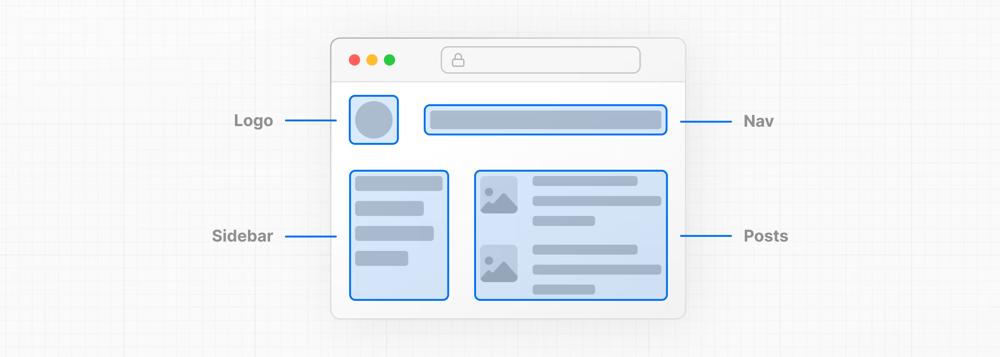
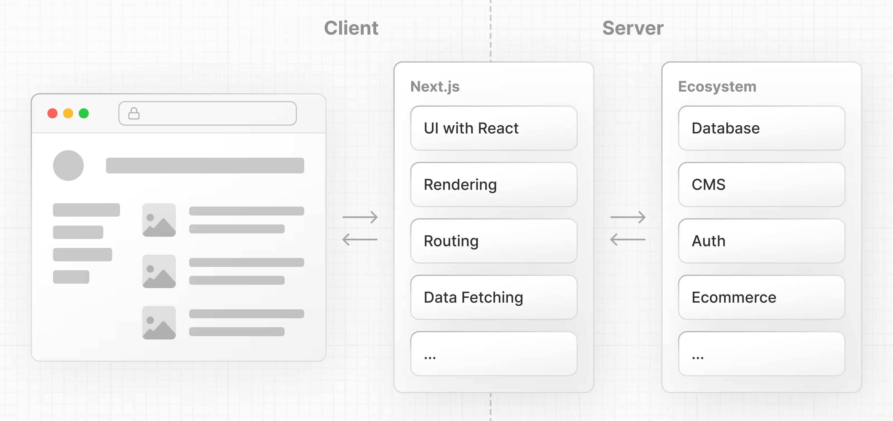

FUNDAMENTOS DE REACT

- Next.js es un marco React flexible que le brinda bloques de construcción para crear aplicaciones web rápidas y completas .

¿Qué es React?
- ReaccionarEs una biblioteca de JavaScript para crear interfaces de usuario interactivas 

¿Qué es Next.js?
- Next.js es un marco React que le proporciona bloques de construcción para crear aplicaciones web.

