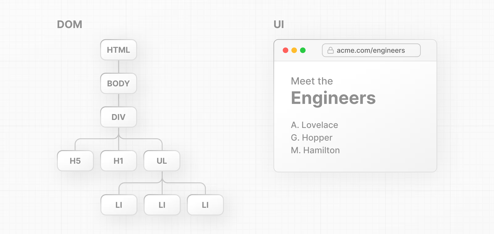

What is the DOM?
- The DOM is an object representation of the HTML elements. It acts as a bridge between your code and the user interface, and has a tree-like structure with parent and child relationships.
- El DOM es una representación de objetos de los elementos HTML. Actúa como puente entre el código y la interfaz de usuario, y tiene una estructura de árbol con relaciones entre elementos padre e hijo.
Puede utilizar métodos DOM y JavaScript para escuchar eventos de usuario y manipular el DOM.Al seleccionar, agregar, actualizar y eliminar elementos específicos en la interfaz de usuario, la manipulación del DOM permite no solo identificar elementos específicos, sino también cambiar su estilo y contenido.

